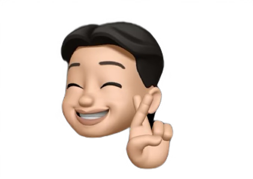

# 현대 온라인 박물관 MHMUSEUM

배포 URL: https://mhmuseum.netlify.app/

# 프로젝트 소개

- 근현대사의 주요 사건을 한눈에 살펴볼 수 있는 온라인 뮤지엄 웹사이트입니다.
  사용자 중심의 인터페이스와 시각적 흐름에 맞춘 스크롤 효과를 통해, 역사를 쉽고 흥미롭게 탐색할 수 있도록 설계했습니다.

---

# 팀원 구성

|                   김지선                    |                   한현수                    |                   정수아                    |
| :-----------------------------------------: | :-----------------------------------------: | :-----------------------------------------: | :-: | -------------------------------- |
|  |  |  |
|       (https://github.com/JisunKim32)       |                                             |      (https://github.com/hyunsoohan99)      |     | (https://github.com/Jeongsua717) |

1. 개발 환경
   | 항목 | 사용 내용 |
   |-----------------|---------------------------------------------------------------------------|
   | **에디터** | VS Code (`.vscode/settings.json` 존재) |
   | **마크업 언어** | HTML5 (`index.html`, `*.html`) |
   | **스타일링** | SCSS (모듈화된 `.scss` 파일 사용), CSS (`style.css`, `main.css`) |
   | **스크립트 언어** | JavaScript (`assets/js/*.js`) |
   | **이미지 리소스** | PNG, SVG (다양한 아이콘 및 로고) |
   | **버전 관리** | Git (`.gitignore` 존재) |
   | **SEO 설정** | `robots.txt`, `sitemap.xml` 포함 |
   | **폴더 구조화** | 뉴스/공지 상세, 컴포넌트, 자산(assets), SCSS 등 기능별 폴더로 체계적 분할 |

2. 채택한 개발 기술과 브랜치 전략
3. 프로젝트 구조
   Team-Project_MH/
   ├── .vscode/ # VSCode 설정
   ├── assets/ # 정적 리소스 (CSS, JS, 이미지 등)
   │ ├── css/
   │ ├── images/
   │ ├── js/
   │ └── scss/
   ├── component/ # 공통 컴포넌트
   ├── news-detail/ # 뉴스 상세 페이지들
   ├── notice-detail/ # 공지사항 상세 페이지들
   ├── .gitignore
   ├── history-content.html
   ├── history-detail.html
   ├── history-select.html
   ├── index.html # 메인 페이지
   ├── news-select.html # 뉴스 리스트 페이지
   ├── notice-select.html # 공지 리스트 페이지
   ├── README.md
   ├── robots.txt # SEO 설정
   └── sitemap.xml 4. 역할 분담

4. 역할 분담
   김지선: 자료조사, 기획서 작성, 보고서 작성, variables 파일 제작, 코딩, 디자인
   한현수: 디자인 작업, common, responsive 파일 제작, 코딩, 기획서작성, 보고서 작성
   정수아: 프론트엔드, common, responsive, component 파일 제작, 코딩, 디자인, 벤치마킹, 자료조사
5. 개발 기간 및 작업 관리
   전체 개발 기간 : 2025-06-10 ~ 2025-06-31
   UI 구현 : 2025-06-17 ~ 2025-06-22
   기능 구현 : 2025-06-23 ~ 2025-06-30
